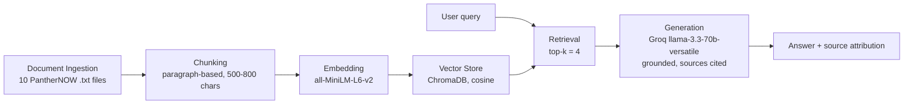

# Pipeline Architecture

```mermaid
flowchart LR
    A[Document Ingestion<br/>10 PantherNOW .txt files] --> B[Chunking<br/>paragraph-based, 500-800 chars]
    B --> C[Embedding<br/>all-MiniLM-L6-v2]
    C --> D[Vector Store<br/>ChromaDB, cosine]
    E[User query] --> F[Retrieval<br/>top-k = 4]
    D --> F
    F --> G[Generation<br/>Groq llama-3.3-70b-versatile<br/>grounded, sources cited]
    G --> H[Answer + source attribution]
```

Each stage labeled with the tool/library used, as required by Milestone 2.
