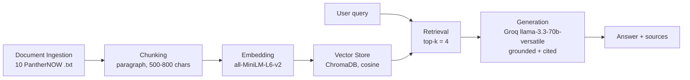

# Project 1 Planning: The Unofficial Guide

---

## Domain

I'm covering **dining at and around FIU** — campus dining halls, the meal plan, the food
courts, dietary options, and the off-campus spots close enough to hit between classes.

I chose this from personal experience. My first year I struggled just to figure out how to use
my meal plan and my bonus meals, and I didn't know how to spend most of my dining dollars for
months — until a friend told me you could use them through the GrubHub app. The official
information is so short and sometimes ambiguous that it's hard to actually understand or use it
unless you go and try things yourself. The candid, practical knowledge — whether the meal plan
is worth it, where to eat between classes, what actually works for a dietary restriction — lives
in student-newspaper opinion pieces and word of mouth, never on the official ShopFIU dining page
(which lists hours but never tells you the dining hall is repetitive or that BBC runs out of
food).

---

## Documents

10 sources, all from PantherNOW (FIU's independent student newspaper). I deliberately mixed
opinion pieces (which carry the candid judgments) with food guides and news (which carry the
factual venue/hours/price details) so the corpus answers a *range* of questions.

| #  | Source | Description | URL or location |
|----|--------|-------------|-----------------|
| 1  | PantherNOW (Opinion, 2017) | Meal plans are not as beneficial as they seem | https://panthernow.com/2017/02/24/meal-plans-are-not-as-beneficial-as-they-seem/ |
| 2  | PantherNOW (Guide, 2023) | Best places to eat near the Modesto Maidique Campus | https://panthernow.com/2023/06/30/best-places-to-eat-near-fius-modesto-maidique-campus/ |
| 3  | PantherNOW (Guide, 2021) | Ten iconic food spots around MMC and BBC | https://panthernow.com/2021/08/31/ten-iconic-food-spots-you-need-to-try-around-the-mmc-and-bbc-campuses/ |
| 4  | PantherNOW (Opinion, 2024) | FIU is in dire need of more diverse food options | https://panthernow.com/2024/03/17/from-options-like-the-salty-donut-or-chick-fil-a-it-can-be-difficult-for-students-to-stay-within-their-diet-or-avoid-allergens/ |
| 5  | PantherNOW (Opinion, 2023) | BBC needs more food options | https://panthernow.com/2023/04/21/bbc-needs-more-food-options/ |
| 6  | PantherNOW (News, 2018) | New dining hall replaces 'Fresh' (8th St. Kitchen) | https://panthernow.com/2018/09/18/new-dining-hall-replaces-fresh/ |
| 7  | PantherNOW (News, 2022) | Taking a look into 8th Street Kitchen | https://panthernow.com/2022/08/31/taking-a-look-into-8th-street-kitchen/ |
| 8  | PantherNOW (Guide, 2022) | On-campus dining options for students this summer | https://panthernow.com/2022/06/22/on-campus-dining-options-for-students-this-summer/ |
| 9  | PantherNOW (News, 2024) | FIU's food pantry increases in usage | https://panthernow.com/2024/01/25/student-fiu-food-pantry-usage/ |
| 10 | PantherNOW (Letter, 2011) | Healthy options available on campus | https://panthernow.com/2011/10/21/letter-to-the-editor-healthy-options-available-on-campus/ |

Raw text is saved in `documents/` with a metadata header (source, URL, title, author, date).

---

## Chunking Strategy

**Chunk size:** 500–800 characters, paragraph-based (implemented in `ingest.py` with
MIN_CHUNK=200, MAX_CHUNK=800). Small paragraphs are merged together; any paragraph longer than
the max is split on sentence boundaries. Final result: 44 chunks across 10 documents.

**Overlap:** 0 characters. Because I split on paragraph boundaries, each chunk already ends at a
natural break, so there's no mid-sentence cut for overlap to protect against. I'd only add
overlap (~10–15%) if I switched to fixed-character chunking.

**Reasoning:** these articles are written one-thought-per-paragraph — one venue with its hours
and prices, or one complaint. A fixed 500-character cut would slice a venue's name away from its
hours; a whole-article chunk would merge 10+ venues into one blob and dilute retrieval.
Paragraph chunks keep "complete, retrievable thoughts." A bad chunk here would be a fragment
like "2. specialTEA Lounge and Café" with the hours cut off — unanswerable on its own.

---

## Retrieval Approach

**Embedding model:** all-MiniLM-L6-v2 via sentence-transformers (runs locally, no API key, no
rate limits — well-suited to short review-style text).

**Vector store:** ChromaDB (persistent, cosine distance).

**top-k:** 4. The candid answers tend to concentrate in one or two articles, so a tight k keeps
the LLM focused and avoids pulling in loosely related venue lists. I'll widen to k=5 only if
retrieval misses context split across articles. (During evaluation this tradeoff showed up as a
real failure — see the Failure Case in the README.)

**Production tradeoff:** if cost weren't a constraint I'd reconsider language support (FIU is
heavily bilingual and MiniLM is English-only) and scale/freshness (re-embedding as venues and
prices change), weighing a multilingual or hosted model against latency and cost.

---

## Evaluation Plan

Five test questions with ground-truth answers verifiable against the documents. These live in
`eval_questions.json` and are run with `eval.py`.

1. **Is the meal plan worth it for students who live on campus?** — Expected: often not; the
   dining hall is repetitive and students could save ~$1,899–$2,099 if it weren't mandatory.
2. **What dining options does BBC have, and the main complaint?** — Expected: only four
   (Roary's, Starbucks, Vicky's, Chick-fil-A) vs 35+ across campuses; limited hours/shortages.
3. **Where can students with gluten or kosher restrictions eat?** — Expected: limited; 8th St.
   Kitchen only "avoids" gluten, Miro's is the one consistent kosher option, closed weekends.
4. **What are some late-night food spots near campus?** — Expected: Night Owl (to 2–3am) and
   Rancho Mateo (to 2am weekdays).
5. **How much does parking cost at FIU?** — Expected: out of scope; the system should refuse.

---

## Anticipated Challenges

- **Stale data:** documents span 2011–2024, so some venues, hours, and prices are out of date
  and the system may state old hours confidently.
- **Conflicting sources:** opinion pieces disagree (one says healthy options exist, another says
  they don't) — the system should report what the documents say, not invent one answer.
- **Off-topic retrieval:** when a question's wording overlaps several venue lists, retrieval can
  pull loosely related chunks (exactly what happened in the Q4 late-night failure case).

---

## Architecture

Document Ingestion → Chunking (paragraph, 500–800 chars) → Embedding (all-MiniLM-L6-v2) →
Vector Store (ChromaDB, cosine) → Retrieval (top-k = 4) → Generation (Groq
llama-3.3-70b-versatile, grounded, sources cited).

---

## AI Tool Plan

I made the design decisions (domain, chunk strategy and sizes, k, the 5 eval questions) myself
and used Claude to implement each pipeline stage from this spec, then reviewed and tested the
output.

**Milestone 3 — Ingestion and chunking:** Give Claude the Chunking Strategy section above and
ask it to implement `ingest.py` — load the `documents/` files, strip the metadata header,
paragraph-chunk at my 500–800 char target. Verify by inspecting 5 sample chunks to confirm none
are cut mid-venue.

**Milestone 4 — Embedding and retrieval:** Give Claude the Retrieval Approach section and ask it
to implement `rag.py` — embed with all-MiniLM-L6-v2, store in ChromaDB with source metadata, and
a `retrieve()` returning top-4 with distances. Verify by checking distances on the eval queries
are below 0.5.

**Milestone 5 — Generation and interface:** Ask Claude to implement grounded generation (Groq,
answer only from retrieved context) and a Gradio interface. Verify the system prompt actually
enforces grounding and that source attribution is built in code, not left to the LLM.
